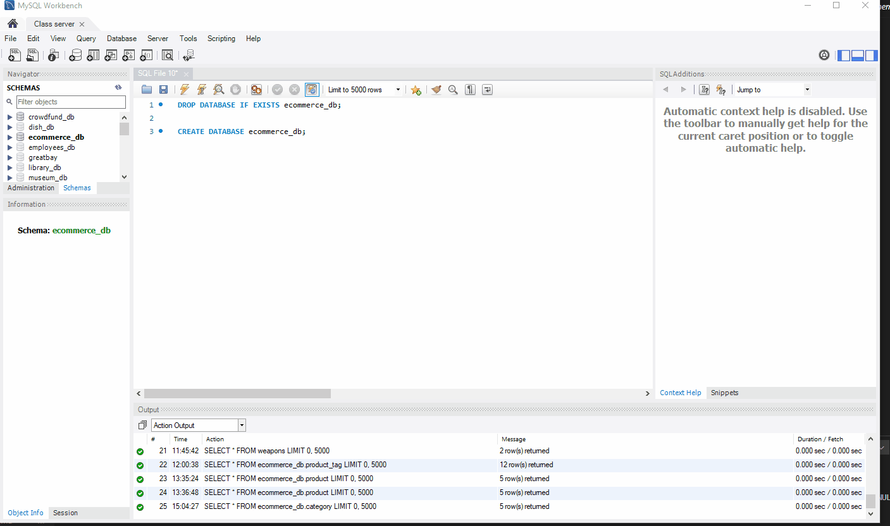

# E-Commerce-ORM

  ## Table of Contents 

  1. [Description](#description) 

  2. [Installation](#installation-guidelines) 

  3. [License](#license) 

  4. [Preview](#preview)

  5. [Question](#questions)  

  ## Description 

  A backend built by configuring a working Express.js API to use Sequelize to interact with a MySQL database for an e-commerce site.
 
  ## Installation guidelines 

  Have node.js installed on your machine. 
  run npm i to install dependencies.

  Required node packages: dotenv, express, mysql12, and sequelize.

  ## License 

  

  ## Preview

  Creating schema from MySQL shell  
  

  Seeding database from command line & starting application's server
  

  GET Routes for all or single category, product, and tag
  

  POST routes for tags, categories, and products.
  

  PUT routes for tags, categories, and products.
  

  DELETE routes for tags, categories, and products.
  

  ## Questions 
  Email me with additional questions at 
  Rachel7113@gmail.com